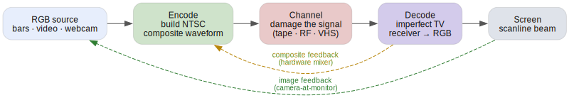
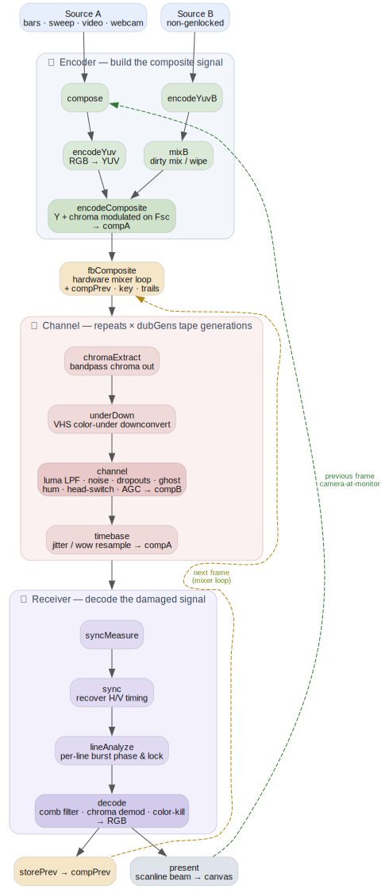

# Phosphene

Live demo - https://cmdcolin.github.io/phosphene/

Needs a WebGPU-enabled browser

Real-time analog video glitch as **signal-level simulation**, not image filters.
Every frame is encoded to a physically-modeled NTSC composite waveform, degraded
as a 1D signal, and decoded by a deliberately imperfect (but real) decoder — all
in WebGPU compute. Dot crawl, rainbow chroma, ringing, tearing, head-switch
bend, hue drift, and dropouts all emerge from the signal path; nothing is
painted on. Two feedback loops re-enter the chain each frame (camera-at-monitor
and a hardware mixer loop), and a second non-genlocked source can be dirty-mixed
in.

## Run

```
pnpm install
pnpm dev
```

`pnpm test` runs the FIR design unit tests (DC gain, passband/stopband response,
linear-phase symmetry, filter-bank packing). CI gates deploy on `pnpm lint` +
`pnpm test`.

- **Sources**: SMPTE bars, multiburst sweep, video/image file, webcam; plus an
  independent source B for the dirty mixer.
- **Presets**: built-ins + 8 save slots (`1`-`8` load, `shift+1`-`8` save).
- **URL params**: `?set=key:value,...`, `?vurl=…`, `?src=sweep|webcam`,
  `?dbg=1..5`, `?prof` (per-pass GPU timings in the console, needs
  timestamp-query support).

## How it works

The picture is never touched as an image. Each frame the RGB source is turned
into a real NTSC **composite waveform** — a 1D voltage signal sampled at 4×the
color subcarrier (`4·Fsc ≈ 14.318 MHz`, 910 samples × 525 lines) — and every
"glitch" is what happens when you damage that signal and then decode it with an
imperfect receiver. Dot crawl, rainbow chroma, ringing, hue drift, tearing and
dropouts are all *consequences* of the signal path, not effects painted on top.

Every stage is a WebGPU compute pass over a shared buffer (`src/gpu/shaders/*.wgsl`,
orchestrated in `src/gpu/pipeline.ts`). All FIR kernels are windowed-sinc filters
designed from real MHz specs in `src/signal/filters.ts` (luma lowpass, chroma
bandpass at `Fsc`, demod lowpass, color-under). The waveform lives in `compA`;
passes read and rewrite it in place.

The whole thing in five blocks — a signal built, damaged, and decoded, with two
feedback loops re-entering each frame:



<details>
<summary><b>Full pass diagram</b> — every WebGPU compute pass, in order</summary>



</details>

<sup>Diagrams are Graphviz: [`docs/pipeline-simple.dot`](docs/pipeline-simple.dot),
[`docs/pipeline.dot`](docs/pipeline.dot). Regenerate both with `pnpm run docs`
(needs `dot` on PATH).</sup>

Two feedback loops re-enter the chain each frame:

- **Camera-at-monitor** (image domain): `compose` re-reads the *previous* decoded
  frame with zoom / rotate / shift / gain / vignette before re-encoding — the
  classic pointing-a-camera-at-its-own-monitor loop.
- **Hardware mixer** (composite domain): `storePrev` captures the decoded-line
  waveform into `compPrev`, and `fbComposite` mixes it back into this frame's
  composite with keying and trails — feedback at signal level, so it dot-crawls
  and smears like a real vision mixer.

| Stage | Pass(es) | What it models |
|-------|----------|----------------|
| Encoder | `compose`, `encodeYuv`, `encodeComposite` | RGB → YUV → composite: luma + chroma quadrature-modulated onto the `Fsc` subcarrier, sync/burst/blanking inserted |
| Dirty mix | `encodeYuvB`, `mixB` | second non-genlocked source B mixed/wiped in, with its own hue/ring/detune |
| Channel | `chromaExtract`, `underDown`, `channel`, `timebase` | the tape/RF path — color-under, band-limiting, noise, dropouts, ghosting, hum, head-switch bend, time-base jitter. Loops once per **dub generation** |
| Receiver | `syncMeasure`, `sync`, `lineAnalyze`, `decode` | a real (imperfect) TV: sync recovery, per-line burst lock, comb filtering, chroma demod, color-kill |
| Display | `present` | scanline beam profile to the canvas |

## Verification harness

```
node scripts/shot.mjs http://localhost:5199/ out.png [waitMs]
```

Drives headed Firefox Nightly, steps frames deterministically, probes pixels,
saves a screenshot. (Headless Chrome can't present WebGPU swap chains here.)

---

This project was kicked off with [Fable](https://claude.com/). it really nailed
the crazy complexity of the task. I had previous asked opus and it was not
nearly this good, though it targetted python, but it really just didn't
understand the 'signal level' ideas for making the glitches
