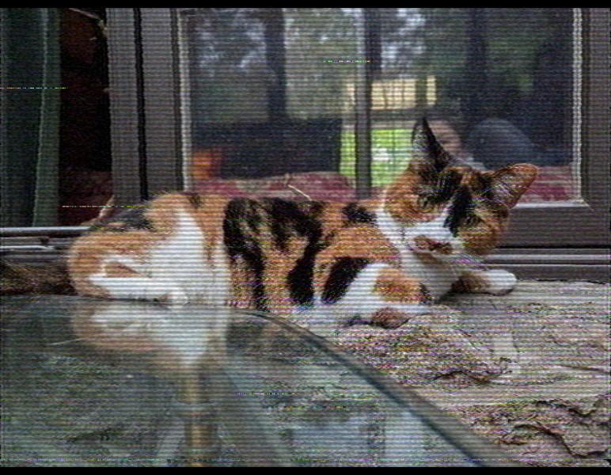
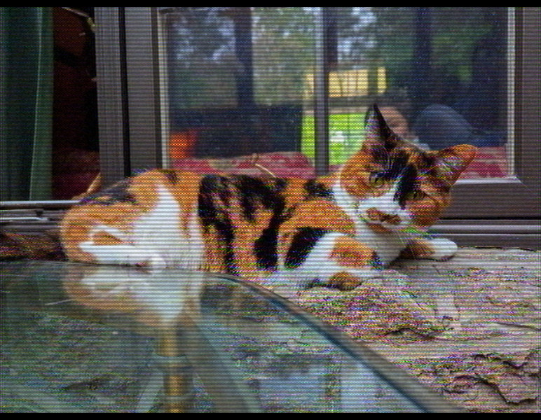
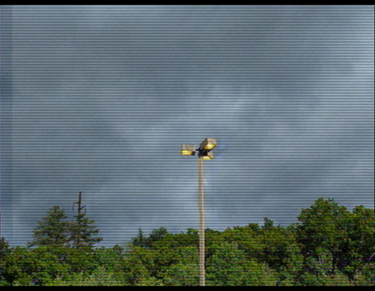

# Phosphene

> A real-time **NTSC / VHS / composite-video glitch** simulator, running entirely
> in **WebGPU** compute shaders. The artifacts fall out of a simulated analog
> signal — they aren't filters painted over the picture.

**[Live demo](https://cmdcolin.github.io/phosphene/)** — needs a WebGPU-enabled
browser.

<sub>Sometimes searched as: a VHS filter, camcorder / analog-video effect, NTSC
emulator, composite-video or CRT glitch, datamosh-adjacent, no-input video
feedback, or a browser video synth — for glitch-art, vaporwave, and
analog-horror looks.</sub>

Each frame gets encoded into a real composite video waveform, mangled like it
went through tape and RF, then decoded by an imperfect TV. Dot crawl, ringing,
hue drift, tearing, head-switch bend, dropouts — you don't draw any of that. It
comes out of the signal on its own, same as on the real gear. There are two
feedback loops as well (a camera pointed at its own monitor, and a
hardware-mixer loop), and you can dirty-mix in a second source. All in WebGPU
compute shaders, in real time.


## Gallery

|                                                                             |                                                                                |                                                                                        |
| --------------------------------------------------------------------------- | ------------------------------------------------------------------------------ | -------------------------------------------------------------------------------------- |
|  |          |       |
| <sub>**vhs** — a photo dubbed to tape: color-under chroma, head-switch wobble, dropouts</sub> | <sub>**mixer loop** — the composite waveform fed back into itself</sub>        | <sub>**fb bloom** — camera-at-monitor feedback blooming through the CRT</sub>          |
|  |  |  |
| <sub>**dirty mix** — a second, non-genlocked source beating against A</sub> | <sub>**s-video miswire** — luma leaking into the chroma pin as rainbows</sub>  | <sub>**weak broadcast** — a distant RF signal, snow creeping in from the top</sub>     |

<sup>Regenerate with `node scripts/gallery.mjs` (dev server + Firefox Nightly
running, see below).</sup>

## Run

```
pnpm install
pnpm dev
```

`pnpm test` runs the FIR design unit tests (DC gain, passband/stopband response,
linear-phase symmetry, filter-bank packing). CI gates deploy on `pnpm lint` +
`pnpm test`.

- **Sources**: SMPTE bars, multiburst sweep, video/image file, webcam; plus an
  independent source B for the dirty mixer.
- **Presets**: built-ins + 9 scene slots (`1`–`9` recall, `shift+1`–`9` save).
- **Performing**: `f` fullscreens the stage, and **⧉ pop out** moves the
  controls into their own window — project one screen, tweak from the other.
- **URL params**: `?set=key:value,...`, `?vurl=…`, `?src=sweep|webcam`,
  `?dbg=1..5`, `?prof` (per-pass GPU timings in the console, needs
  timestamp-query support).

## How it works

The picture is never handled as an image. Each frame, the RGB source is turned
into a real NTSC composite waveform — a 1D voltage signal sampled at four times
the color subcarrier, about 478,000 samples a frame (910 per line, 525 lines).
Every "glitch" is just what happens when you rough that signal up and decode it
with an imperfect receiver.

### If you write JavaScript, here's the shape of it

That waveform is really just one big `Float32Array` — those ~478k samples —
sitting in GPU memory (the `compA` buffer) and never coming back to the CPU.
Each stage of the chain is a _compute pass_: picture a function that takes some
buffers, reads that array, and writes it back, except the body runs on thousands
of GPU cores at once, one for every sample.

The CPU barely does any signal math. Once per animation frame it uploads the
source frame to a texture, writes the current slider values into a small
uniforms buffer, records the whole list of passes into a command buffer, and
submits it. No `await`, nothing read back.

Recording a pass is just `setPipeline`, `setBindGroup`,
`dispatchWorkgroups(x, y)`. That dispatch is basically a 2D parallel for-loop:
`y` counts the 525 lines, `x` counts the samples across a line (in groups of
64). A "bind group" is just the list of buffers a pass is wired to — its
arguments.

The passes hand data to each other through those shared buffers. Most read
`compA` and overwrite it in place; a couple ping-pong through `compB`. The only
thing that ever leaves the GPU is the final image the `present` pass draws to
the canvas. So the pipeline really is just an ordered array of passes, each one
a `.wgsl` shader in `src/gpu/shaders/`, wired up in `src/gpu/pipeline.ts`. The
filters they run are windowed-sinc FIR kernels designed from real MHz specs in
`src/signal/filters.ts`.

### The chain

Five blocks: build the signal, damage it, decode it, display. Two feedback loops
fold back in every frame.

<picture>
  <source media="(prefers-color-scheme: dark)" srcset="docs/pipeline-simple-dark.svg">
  
</picture>

Same thing pass by pass, in the order they actually run (the channel block
repeats once per dub generation):

<picture>
  <source media="(prefers-color-scheme: dark)" srcset="docs/pipeline-dark.svg">
  
</picture>

<sup>Diagrams are Graphviz:
[`docs/pipeline-simple.dot`](docs/pipeline-simple.dot),
[`docs/pipeline.dot`](docs/pipeline.dot). `pnpm run docs` regenerates both in
light and dark variants (needs `dot` on PATH).</sup>

The two feedback loops work at different points in the chain:

- **Camera-at-monitor** (in the image): before re-encoding, `compose` reads back
  the _previous_ decoded frame and zooms, rotates, shifts, and dims it. It's the
  same thing as aiming a camera at the screen it's driving.
- **Hardware mixer** (in the signal): `storePrev` stashes the decoded waveform
  in `compPrev`, then `fbComposite` blends it back into the new frame's
  composite with keying and trails. Feeding back at the signal level means it
  dot-crawls and smears like a real vision mixer.

| Stage     | Pass(es)                                            | What it models                                                                                                                                       |
| --------- | --------------------------------------------------- | ---------------------------------------------------------------------------------------------------------------------------------------------------- |
| Encoder   | `compose`, `encodeYuv`, `encodeComposite`           | RGB → YUV → composite: luma + chroma quadrature-modulated onto the `Fsc` subcarrier, sync/burst/blanking inserted                                    |
| Dirty mix | `encodeYuvB`, `mixB`                                | second non-genlocked source B mixed/wiped in, with its own hue/ring/detune                                                                           |
| Channel   | `chromaExtract`, `underDown`, `channel`, `timebase` | the tape/RF path — color-under, band-limiting, noise, dropouts, ghosting, hum, head-switch bend, time-base jitter. Loops once per **dub generation** |
| Receiver  | `syncMeasure`, `sync`, `lineAnalyze`, `decode`      | a real (imperfect) TV: sync recovery, per-line burst lock, comb filtering, chroma demod, color-kill                                                  |
| Display   | `present`                                           | scanline beam profile to the canvas                                                                                                                  |

## Verification harness

```
node scripts/shot.mjs http://localhost:5199/ out.png [waitMs]
```

Drives a headed Firefox Nightly, steps frames deterministically, probes pixels,
and saves a screenshot. Headless Chrome can't present WebGPU swap chains here,
which is why it's Firefox.

## Related / prior art

Phosphene sits in a small family of analog-video emulators. If you like it, also
look at:

- **[ntsc-rs](https://github.com/valadaptive/ntsc-rs)** and **ntscQT** — NTSC/VHS
  emulation for video files and OBS.
- **[composite-video-simulator](https://github.com/joncampbell123/composite-video-simulator)**
  — the C reference NTSC codec much of this lineage traces back to.
- **Blargg's NTSC filters** (`nes_ntsc` / `snes_ntsc`) and **RetroArch CRT
  shaders** (`crt-royale`, `crt-guest-advanced`) — the emulator/shader side of
  the same idea.
- Hardware roots: **Rutt–Etra** video synthesis, **no-input video feedback**, and
  time-base correctors — the gear Phosphene imitates in software.

What's different here: Phosphene models the whole signal _path_ end to end in
real time — encode → tape/RF damage → imperfect decode → CRT — so the artifacts
interact the way they do on real hardware instead of being independent filters.

---

Note: this project is extensively vibecoded. The initial signal-path design was
one-shotted almost perfectly by [Fable](https://claude.com/), which nailed the
"signal level" idea behind the glitches. An earlier Opus attempt — targeting
Python and static images — hadn't grasped that framing, which surprised me given
how well Opus had done on other work.
